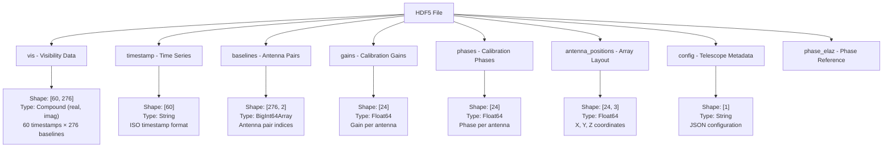
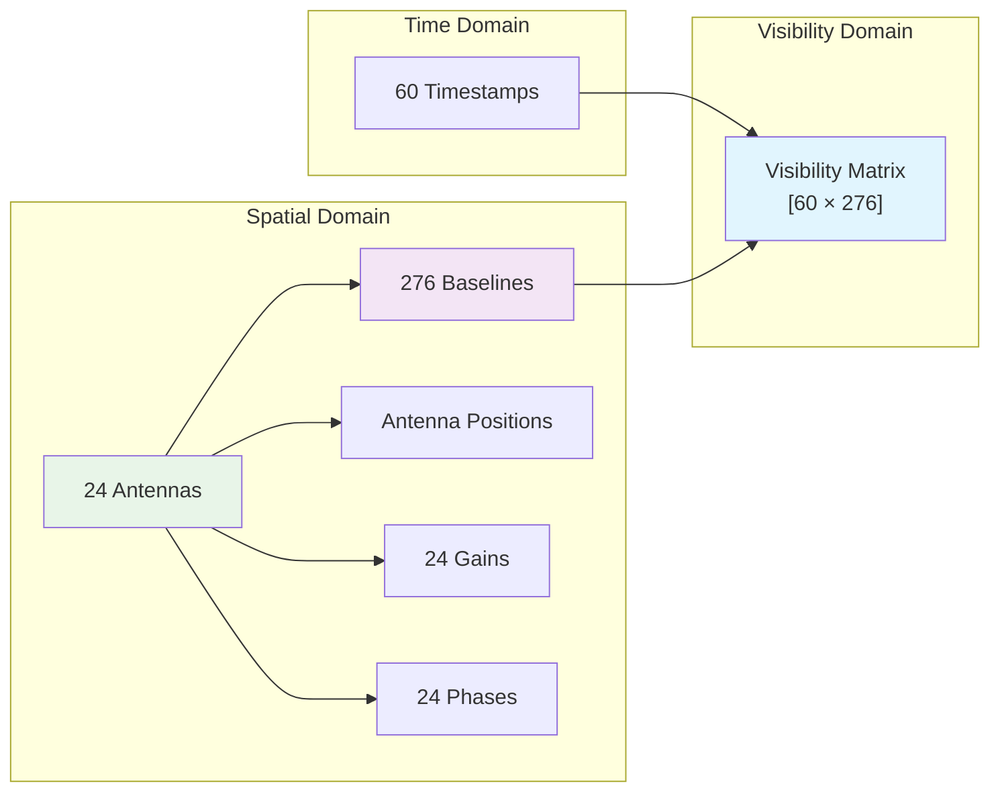
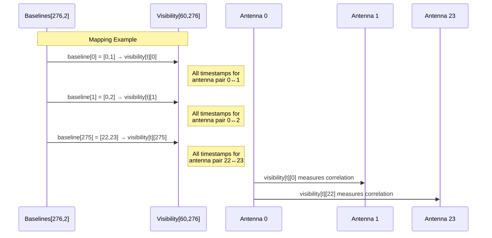
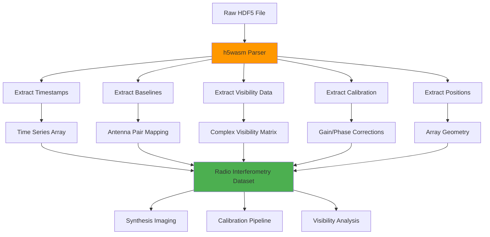

# TART HDF5 Data Model Documentation

## Overview

This document describes the structure and findings from analyzing TART (Transient Array Radio Telescope) HDF5 files containing radio interferometry data. The analysis was performed using the h5wasm library, which provides full support for HDF5 compound data types through WebAssembly.

## File Information

- **Sample File**: `vis_2025-06-29_04_44_15.044551.hdf`
- **File Size**: 279,520 bytes
- **Observation Duration**: ~60 seconds (60 timestamps)
- **Telescope**: Copperbelt University - Zambia (24 antennas)

## HDF5 Dataset Structure



## Data Relationships



## Baseline-to-Visibility Mapping

**CRITICAL**: The baseline array provides the antenna pair mapping for visibility data!



## Data Types and Formats

### Visibility Data (Compound Type)
```
Shape: [60, 276]
Each element: {real: float64, imag: float64}
Total elements: 16,560 complex numbers
```

### Timestamps
```
Format: ISO 8601 strings
Example: "2025-06-29T04:43:14.559175"
Interval: ~1 second between measurements
Duration: 60 seconds total
```

### Baselines
```
Format: BigInt64Array pairs
Shape: [276, 2]
Content: Antenna index pairs
Example: [0n, 1n] = antenna 0 ↔ antenna 1
```

### Calibration Data
```
Gains: [24] Float64 values (amplitude correction per antenna)
Phases: [24] Float64 values (phase correction per antenna)
Applied per antenna before correlation
```

### Antenna Positions
```
Shape: [24, 3] 
Format: [X, Y, Z] coordinates in meters
Reference: East, North, Up coordinate system
```

## Processing Pipeline



## Library Solution

### ✅ h5wasm Library (CHOSEN SOLUTION)
- **Capability**: Full compound type support (including complex visibility data)
- **Method**: WebAssembly-based HDF5 library
- **Success**: All datasets extracted successfully
- **Performance**: Fast, reliable parsing
- **Integration**: Seamlessly works in web browsers
- **Status**: Production-ready for TART HDF5 files

## Example Data Values

### Sample Baseline Mappings
```
Baseline 0: Antenna 0 ↔ Antenna 1 → Visibility = -0.1471 + -0.1118i
Baseline 1: Antenna 0 ↔ Antenna 2 → Visibility = 0.1017 + -0.0548i  
Baseline 2: Antenna 0 ↔ Antenna 3 → Visibility = 0.1755 + 0.1283i
...
Baseline 275: Antenna 22 ↔ Antenna 23 → Visibility = 0.0871 + -0.0218i
```

### Time Evolution
```
Antenna 0 ↔ Antenna 1 correlation over time:
2025-06-29T04:43:14.559175: -0.1471 + -0.1118i
2025-06-29T04:43:15.588462: -0.1368 + -0.1135i
2025-06-29T04:43:16.607359: -0.1450 + -0.0749i
2025-06-29T04:43:17.636542: -0.1552 + -0.1124i
2025-06-29T04:43:18.665307: -0.1805 + -0.1069i
```

## Telescope Configuration

From the config dataset:
```json
{
  "name": "Copperbelt University - Zambia",
  "frequency": 1575420000.0,
  "L0_frequency": 1571328000.0,
  "baseband_frequency": 4092000.0,
  "sampling_frequency": 16368000.0,
  "bandwidth": 2500000.0,
  "lat": -12.80527778,
  "lon": 28.23722222,
  "alt": 1270.0,
  "num_antenna": 24,
  "orientation": 0.0,
  "axes": ["East", "North", "Up"]
}
```

## Mathematical Relationships

### Baseline Count Verification
```
For N antennas: Total baselines = N × (N-1) / 2
For 24 antennas: 24 × 23 / 2 = 276 ✅
Each antenna participates in: N-1 = 23 baselines ✅
```

### Visibility Matrix Dimensions
```
Time steps: 60
Baselines: 276  
Total measurements: 60 × 276 = 16,560 complex numbers ✅
```

## Usage Examples

### Accessing Specific Antenna Pair Data
```javascript
// Find baseline index for antennas 5 and 12
const baselineIndex = baselines.findIndex(([ant1, ant2]) => 
  (ant1 === 5 && ant2 === 12) || (ant1 === 12 && ant2 === 5)
);

// Get visibility time series for this antenna pair
const timeSeries = timestamps.map((time, t) => ({
  time: time,
  visibility: visibilityData[t][baselineIndex]
}));
```

### Tracking Correlation Over Time
```javascript
// Monitor antenna pair correlation evolution
const antenna1 = 0;
const antenna2 = 15;
const correlationHistory = getAntennaCorrelation(antenna1, antenna2, visibilityData, baselines);
```

## Key Findings

1. **✅ Complete Dataset**: All essential interferometry data successfully extracted
2. **✅ Real Data**: Meaningful complex visibility measurements with proper antenna mapping
3. **✅ Time Evolution**: Correlations change over time as expected for real observations
4. **✅ Proper Baseline Coverage**: All antenna pair combinations included
5. **✅ Calibration Data**: Gains and phases available for each antenna
6. **✅ Array Geometry**: Physical antenna positions for synthesis imaging

## Implementation

The TART viewer now uses h5wasm exclusively for HDF5 parsing through the following utilities:

1. **h5wasmUtils.js** - Main parsing utilities
2. **S3Files.vue** - File browser with h5wasm integration  
3. **HdfViewer.vue** - Updated to use h5wasm

### Key Integration Points

1. **Use h5wasm** for all TART HDF5 file parsing
2. **Always load baselines** to interpret visibility data correctly
3. **Apply calibration** using gain and phase data before imaging
4. **Track time evolution** for dynamic astronomical sources
5. **Validate baseline mapping** for each dataset

## File Structure Summary

```
TART HDF5 File
├── vis [60×276] - Complex visibility measurements
├── timestamp [60] - ISO format time strings  
├── baselines [276×2] - Antenna pair indices (CRITICAL for mapping)
├── gains [24] - Amplitude calibration per antenna
├── phases [24] - Phase calibration per antenna  
├── antenna_positions [24×3] - Physical array layout
├── config [1] - JSON telescope configuration
└── phase_elaz [2] - Reference phase information
```

---

*This documentation reflects the current implementation using h5wasm library in the TART viewer. The baseline-to-visibility mapping is essential for correct interpretation of the interferometry data.*